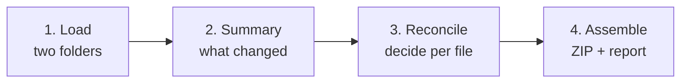

# CodeRecon

### Codebase Reconciliation Studio

**Compare two source folders side by side, decide file by file what to keep, and assemble one merged tree — without Git.**

**[▶ Open CodeRecon](https://ankit-saha08.github.io/coderecon/)**

---

## Table of contents

- [Why this exists](#why-this-exists)
- [Privacy & security](#privacy--security)
- [How it works](#how-it-works)
- [Features](#features)
- [Status classification](#status-classification)
- [Decisions](#decisions)
- [Smart defaults](#smart-defaults)
- [Keyboard shortcuts](#keyboard-shortcuts)
- [Output](#output)
- [Getting started](#getting-started)
- [Deployment](#deployment)
- [Project structure](#project-structure)
- [Tech stack](#tech-stack)
- [Design decisions](#design-decisions)
- [Known limitations](#known-limitations)
- [Troubleshooting](#troubleshooting)
- [Roadmap](#roadmap)
- [License](#license)

---

## Why this exists

Some environments restrict Git, GitHub, and equivalent tooling. Without version control you end up with folders like `src`, `src-v2`, `src_final`, `src_backup_march` — and no safe way to combine them. Copy-pasting one over the other silently destroys work.

CodeRecon is a **reconciliation tool**, not a version control system. It has no branches, commits, clones, or history. It does exactly one thing:

> Take two folders. Show you every difference. Let you choose what survives. Produce a new merged folder — and a written record of every decision.

**The core promise: nothing is ever overwritten.** Inputs are read-only. Output is always a fresh tree. Files that could go either way *must* be reviewed before you can export.

---

## Privacy & security

**Every byte stays on your machine.** There is no server, no API, no telemetry, no analytics, no cookies, no storage of your code anywhere.

Folders are read locally through the browser's File System APIs. All hashing, diffing, merging, and ZIP creation happens in your tab.

### Verify it yourself in ten seconds

1. Open DevTools → **Network** tab
2. Filter to **Fetch/XHR**
3. Load two folders and run a full comparison

The panel stays **completely empty**.

This isn't just a promise — a Content Security Policy with `connect-src 'none'` means the browser *blocks* any network request the page could attempt. CodeRecon makes none.

---

## How it works

### 1 · Load

Pick or drag two folders. They're labelled by **role**, not letter, so the merge semantics are obvious:

| Slot | Role | Meaning |
|:-:|---|---|
| **A** | Current / Base | The version you trust today |
| **B** | Incoming | The version with new work to fold in |

Root folder names don't need to match — `src`, `src-v2`, and `project/src` all pair correctly, because only the picked root segment is stripped.

Configure exclusion globs (`node_modules/**`, `dist/**`, `*.log`, …) and comparison options before scanning.

### 2 · Summary

Before drowning you in files, you get the headline number: **how many files actually need a human decision.** Typically a handful out of thousands. Clickable stat cards jump straight into a filtered review queue.

### 3 · Reconcile

A three-pane workspace: virtualised folder tree on the left, diff viewer on the right, decision bar underneath. Full keyboard navigation. Bulk actions scoped to whatever's currently filtered.

### 4 · Assemble

Review the output manifest — every file, labelled with which side it came from — then export.

---

## Features

### Ingestion
- **Folder picker** (`webkitdirectory`) and **drag-and-drop** (Entries API, with correct >100-entry pagination)
- **Path normalisation** — Windows `\` → `/`, root-segment stripping, optional case-insensitive pairing
- **Glob exclusions** with `.gitignore`-style semantics (`dist/**` also matches `packages/app/dist/x.js`)
- **SHA-256 identity check** for instant skip of identical files (falls back to a fast 128-bit FNV-1a checksum when `crypto.subtle` is unavailable, e.g. over `file://`)
- **Binary detection** via NUL bytes and control-character ratio in the first 8 KB
- **Encoding handling** — UTF-8/UTF-16 BOM detection, strict decode, undecodable files treated as binary
- **Line-ending detection** — LF / CRLF / MIXED, reported per file
- Bounded-concurrency reading (8 parallel) so thousands of files scan in seconds

### Comparison
-
