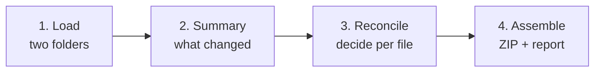

<div align="center">


# CodeRecon

### Codebase Reconciliation Studio

**Compare two source folders side by side, decide file by file what to keep, and assemble one merged tree — without Git.**

[](https://ankit-saha08.github.io/coderecon/)
[](#privacy--security)
[](#privacy--security)
[](https://react.dev)
[](https://www.typescriptlang.org)
[](https://vite.dev)

**[▶ Open CodeRecon](https://ankit-saha08.github.io/coderecon/)**

</div>

---

## Table of contents

- [Why this exists](#why-this-exists)
- [Privacy & security](#privacy--security)
- [How it works](#how-it-works)
- [Features](#features)
- [Status classification](#status-classification)
- [Decisions](#decisions)
- [Smart defaults](#smart-defaults)
- [Keyboard shortcuts](#keyboard-shortcuts)
- [Output](#output)
- [Getting started](#getting-started)
- [Deployment](#deployment)
- [Project structure](#project-structure)
- [Tech stack](#tech-stack)
- [Design decisions](#design-decisions)
- [Known limitations](#known-limitations)
- [Troubleshooting](#troubleshooting)
- [Roadmap](#roadmap)
- [License](#license)

---

## Why this exists

Some environments restrict Git, GitHub, and equivalent tooling. Without version control you end up with folders like `src`, `src-v2`, `src_final`, `src_backup_march` — and no safe way to combine them. Copy-pasting one over the other silently destroys work.

CodeRecon is a **reconciliation tool**, not a version control system. It has no branches, commits, clones, or history. It does exactly one thing:

> Take two folders. Show you every difference. Let you choose what survives. Produce a new merged folder — and a written record of every decision.

**The core promise: nothing is ever overwritten.** Inputs are read-only. Output is always a fresh tree. Files that could go either way *must* be reviewed before you can export.

---

## Privacy & security

**Every byte stays on your machine.** There is no server, no API, no telemetry, no analytics, no cookies, no storage of your code anywhere.

Folders are read locally through the browser's File System APIs. All hashing, diffing, merging, and ZIP creation happens in your tab.

### Verify it yourself in ten seconds

1. Open DevTools → **Network** tab
2. Filter to **Fetch/XHR**
3. Load two folders and run a full comparison

The panel stays **completely empty**.

This isn't just a promise — a Content Security Policy with `connect-src 'none'` means the browser *blocks* any network request the page could attempt. CodeRecon makes none.

---

## How it works



### 1 · Load

Pick or drag two folders. They're labelled by **role**, not letter, so the merge semantics are obvious:

| Slot | Role | Meaning |
|:-:|---|---|
| **A** | Current / Base | The version you trust today |
| **B** | Incoming | The version with new work to fold in |

Root folder names don't need to match — `src`, `src-v2`, and `project/src` all pair correctly, because only the picked root segment is stripped.

Configure exclusion globs (`node_modules/**`, `dist/**`, `*.log`, …) and comparison options before scanning.

### 2 · Summary

Before drowning you in files, you get the headline number: **how many files actually need a human decision.** Typically a handful out of thousands. Clickable stat cards jump straight into a filtered review queue.

### 3 · Reconcile

A three-pane workspace: virtualised folder tree on the left, diff viewer on the right, decision bar underneath. Full keyboard navigation. Bulk actions scoped to whatever's currently filtered.

### 4 · Assemble

Review the output manifest — every file, labelled with which side it came from — then export.

---

## Features

### Ingestion
- **Folder picker** (`webkitdirectory`) and **drag-and-drop** (Entries API, with correct >100-entry pagination)
- **Path normalisation** — Windows `\` → `/`, root-segment stripping, optional case-insensitive pairing
- **Glob exclusions** with `.gitignore`-style semantics (`dist/**` also matches `packages/app/dist/x.js`)
- **SHA-256 identity check** for instant skip of identical files (falls back to a fast 128-bit FNV-1a checksum when `crypto.subtle` is unavailable, e.g. over `file://`)
- **Binary detection** via NUL bytes and control-character ratio in the first 8 KB
- **Encoding handling** — UTF-8/UTF-16 BOM detection, strict decode, undecodable files treated as binary
- **Line-ending detection** — LF / CRLF / MIXED, reported per file
- Bounded-concurrency reading (8 parallel) so thousands of files scan in seconds

### Comparison
- Word-level highlighting inside changed lines
- **Split** and **inline** diff modes
- Unchanged regions collapse to `⋯ N unchanged lines ⋯`
- Whole-file view for files present on only one side
- Checksum comparison card for binary and oversized files
- Whitespace-only and EOL-only differences classified separately, so real changes aren't buried

### Reconciliation
- Virtualised tree — 5,000+ files scroll smoothly
- Per-folder file counts and pending-decision badges
- Live filters: Needs review · Changed · Modified · Only A · Only B · All
- Path search
- Bulk actions scoped to the current filter
- Per-file notes that flow into the merge report
- **Export is gated** — the Assemble button stays disabled while any file lacks a decision

### Merging
- **Keep A / Keep B** — byte-exact passthrough of the chosen side
- **Keep both** — emits A plus B renamed to `file.incoming.ts`
- **Merge hunks** — per-block `A only` / `B only` / `A + B` / `Neither`, with a live preview of the composed result
- **Edit manually** — free-text editor, seeded from A, B, or the auto-merge
- **Exclude** — omit from output entirely

### Export
- **Byte-exact ZIP** — original `File` objects are written directly, so BOMs, CRLF endings, UTF-16, and binaries survive untouched
- **Path collision protection** — duplicates get `-2`, `-3` suffixes plus a warning; nothing is silently clobbered
- **Merge report** in Markdown and CSV — your changelog, since there's no commit history
- **Session file** (JSON) — save and restore every decision, including hunk picks and manual edits
- **Save to folder…** — writes directly to disk via the File System Access API (Chromium browsers, HTTPS only)

---

## Status classification

Every unique path across both folders is classified:

| Status | Meaning | Needs review? |
|---|---|:-:|
| `identical` | Same checksum on both sides | ✅ auto |
| `modified` | Text differs meaningfully | ⚠️ **yes** |
| `whitespaceOnly` | Differs only by whitespace, indentation, blank lines, or line endings | ✅ auto |
| `onlyInA` | Present in A, absent from B | ✅ auto |
| `onlyInB` | Present in B, absent from A | ✅ auto |
| `binaryDiff` | Binary or oversized file with differing checksums | ⚠️ **yes** |
| `typeConflict` | A file on one side collides with a folder name on the other | ⚠️ **yes** |

The engine also detects **subset relationships**. If B is A plus appended lines, you'll see *"B appears to be A plus additions — taking B is likely safe"* and `Keep B` is pre-selected.

---

## Decisions

| Decision | Output | Encoding | Requirements |
|---|---|---|---|
| **Keep A** | A's file at the original path | Byte-exact | Exists in A |
| **Keep B** | B's file at the original path | Byte-exact | Exists in B |
| **Keep both** | A at original path + B as `file.incoming.ext` | Byte-exact | Exists in both |
| **Merge hunks** | Composed from per-block picks | UTF-8 | Decodable text on both sides |
| **Edit manually** | Exactly what you type | UTF-8 | Decodable text on either side |
| **Exclude** | Nothing — file omitted | — | Always available |

**Byte-exact** means the original `File` is passed straight through to the ZIP with no decode/re-encode step. Merged and manual files are new content, so they're necessarily written as UTF-8.

### Hunk-level merge

Enter merge mode and each change block gets its own control:

| Pick | Result |
|---|---|
| `A only` | Keep A's version of this block |
| `B only` | Take B's version of this block |
| `A + B` | Emit A's lines, then B's — safest when unsure |
| `Neither` | Drop the block entirely |

A live preview panel shows the composed file with line count and an `nA / nB / nboth` tally. **The preview is exactly what gets exported** — both paths share one cached diff, so hunk numbering can never drift between them.

> Merge composition always uses an *exact* diff. If "ignore whitespace" is enabled, it's suspended for the file being merged, with a visible notice — otherwise whitespace-differing lines would be reported as unchanged and B's formatting would be silently discarded.

---

## Smart defaults

The engine resolves what it can confidently resolve, so the review queue contains only genuine ambiguity:

| Status | Default | Auto-resolved? |
|---|---|:-:|
| `identical` | Keep A | ✅ |
| `onlyInA` | Keep A *(never silently delete)* | ✅ |
| `onlyInB` | Keep B *(it's new work)* | ✅ |
| `whitespaceOnly` | Keep A | ✅ |
| `modified` — B is a superset of A | Keep B *(suggested)* | ❌ review |
| `modified` — genuine divergence | Keep A *(placeholder)* | ❌ review |
| `binaryDiff` / `typeConflict` | Keep A *(placeholder)* | ❌ review |

Files marked ❌ get a placeholder decision so the merge logic never encounters `undefined`, but they stay in the pending queue and block export until reviewed.

**Within hunk merges**, defaults are deliberately conservative: a block that B *deleted* defaults to `A` (keep the code), while a block B *added* defaults to `B`. Losing code always requires an explicit click.

---

## Keyboard shortcuts

Active on the Reconcile screen. Ignored while typing in an input.

| Key | Action |
|:-:|---|
| `j` / `↓` | Next file |
| `k` / `↑` | Previous file |
| `n` | Jump to next **pending** file |
| `1` | Keep A |
| `2` | Keep B |
| `3` | Keep both |
| `m` | Enter hunk-merge mode |
| `e` | Enter manual-edit mode |
| `x` | Exclude |
| `r` | Mark reviewed |

`Ctrl` / `Cmd` / `Alt` combinations pass through to the browser.

---

## Output

A typical export produces:

```
merged-src-20250115-1430.zip
├── src/                              ← your chosen root folder name
│   ├── components/
│   │   ├── Button.tsx                ← from A
│   │   └── Modal.tsx                 ← from B
│   ├── utils/
│   │   ├── date.ts                   ← hunk-merged
│   │   ├── format.ts                 ← from A
│   │   └── format.incoming.ts        ← from B (keep both)
│   └── assets/
│       └── logo.png                  ← byte-identical binary
├── MERGE-REPORT-20250115-1430.md     ← human-readable changelog
├── merge-report-20250115-1430.csv    ← same data, spreadsheet-ready
└── coderecon-session-20250115-1430.json  ← reload every decision later
```

### The merge report

Since there's no commit history, `MERGE-REPORT-*.md` **is** your changelog. It records:

- Both source roots, timestamp, and checksum algorithm used
- Full status summary and output composition counts
- Every non-identical file: status, decision, reviewed flag, sizes, and your note
- A **Composed files** section detailing each merged file's hunk breakdown (`8 hunks → 3 from A, 4 from B, 1 both`)
- Renamed files, excluded files, errors, warnings
- The exact scan settings used, as JSON

### Session files

Save a session mid-review and reload it later. Decisions are keyed by relative path, so a session from yesterday applies cleanly to a fresh scan of slightly changed folders — and reports how many decisions carried over, how many paths were new, and how many saved decisions no longer matched.

---

## Getting started

### Prerequisites

- **Node.js 18+** and npm
- A modern browser (Chrome/Edge recommended for the direct-to-disk export)

### Install and run

```bash
git clone https://github.com/Ankit-Saha08/coderecon.git
cd coderecon
npm install
npm run dev
```

Open the URL Vite prints (usually `http://localhost:5173`).

### Scripts

| Command | What it does |
|---|---|
| `npm run dev` | Dev server with hot reload |
| `npm run build` | Type-check (`tsc -b`) then production build to `dist/` |
| `npm run preview` | Serve the production build locally |
| `npm run check` | `tsc -b --force && vite build` — **matches CI exactly** |

> ⚠️ **Run `npm run check` before pushing.** `tsc -b` is incremental and caches results in `*.tsbuildinfo`, so a local pass can hide errors that CI — which always starts clean — will catch. `--force` disables that cache.

### Trying it out

Point both slots at copies of the same folder and edit one:

```bash
cp -r src testA
cp -r src testB
# then in testB: change some lines, add a file, delete a file
```

Load `testA` as A and `testB` as B. You should see accurate classification, correct defaults, and a pending count covering only the genuinely ambiguous files.

---

## Deployment

CodeRecon is a static SPA — no server-side anything. `npm run build` emits `dist/`, which any static host can serve.

### GitHub Pages *(current setup)*

`.github/workflows/deploy.yml` builds and deploys on every push to `main`. Requires **Settings → Pages → Source: GitHub Actions**.

The base path is set in `vite.config.ts`:

```ts
base: '/coderecon/',   // must match the repository name
```

> If you fork this under a different repo name, update `base` or you'll get a blank page with 404s on `/assets/*`.

### Other hosts

| Host | Command |
|---|---|
| **Netlify** | Drag `dist/` onto [app.netlify.com/drop](https://app.netlify.com/drop) — no Git or CLI needed |
| **Cloudflare Pages** | `npx wrangler pages deploy dist` |
| **Surge** | `npx surge dist` |
| **Self-host** | Serve `dist/` with Caddy, nginx, or any static file server |

For root-domain hosts, set `base: '/'`.

Security headers live in `public/_headers` (honoured by Netlify and Cloudflare; GitHub Pages ignores custom headers, so an equivalent CSP is declared via `<meta>` in `index.html`).

> ⚠️ **`dist/index.html` cannot be opened directly from the filesystem.** Vite emits `<script type="module">`, and browsers block ES modules over `file://`. It must be served over HTTP(S).

---

## Project structure

```
coderecon/
├── .github/workflows/deploy.yml   # CI: build + deploy to Pages
├── public/
│   ├── favicon.svg                # original merge-glyph mark
│   ├── logo.svg                   # display version
│   ├── site.webmanifest
│   └── _headers                   # CSP + cache headers (Netlify/Cloudflare)
├── src/
│   ├── types/
│   │   └── index.ts               # ⭐ the data model — everything reads from here
│   ├── lib/
│   │   ├── paths.ts               # normalisation, root detection, glob matching
│   │   ├── hash.ts                # SHA-256 with FNV-1a fallback
│   │   ├── text.ts                # binary/BOM/EOL detection, whitespace keys
│   │   ├── ingest.ts              # folder picker + drag-and-drop
│   │   ├── reconcile.ts           # ⭐ the engine: pair, classify, seed defaults
│   │   ├── diffEngine.ts          # line + word diff, hunk segmentation, compose
│   │   ├── mergeable.ts           # capability checks (can this file be merged?)
│   │   ├── assemble.ts            # ⭐ decisions → output plan (pure function)
│   │   ├── exportZip.ts           # JSZip + direct-to-disk writer
│   │   ├── report.ts              # Markdown + CSV generators
│   │   ├── session.ts             # save/restore decisions
│   │   ├── stats.ts               # counters and filter predicates
│   │   ├── tree.ts                # flat entries → nested tree → flat rows
│   │   ├── statusMeta.ts          # labels and colours, one source of truth
│   │   └── cn.ts                  # className helper
│   ├── store/
│   │   └── useReconStore.ts       # Zustand store + all actions
│   ├── components/
│   │   ├── UploadScreen.tsx
│   │   ├── OverviewScreen.tsx
│   │   ├── ReconcileScreen.tsx    # layout + keyboard handling
│   │   ├── FileTree.tsx           # virtualised tree
│   │   ├── DiffViewer.tsx         # split/inline diff, binary card, whole-file
│   │   ├── HunkBar.tsx            # per-hunk A/B/both/none control
│   │   ├── MergePreview.tsx       # live composed result
│   │   ├── ManualEditor.tsx       # free-text editor
│   │   ├── DecisionBar.tsx        # the six decisions + note field
│   │   ├── BulkActions.tsx        # bulk apply + session save/load
│   │   └── ExportScreen.tsx       # manifest + downloads
│   ├── App.tsx                    # screen router
│   ├── main.tsx
│   └── index.css                  # Tailwind entry + diff utilities
├── index.html
├── tailwind.config.js             # status colour palette
├── vite.config.ts                 # base path, @ alias
└── tsconfig.app.json
```

> **Note:** `diffEngine.ts` is deliberately *not* named `diff.ts`. With `baseUrl` set, a local file named `diff.ts` shadows the `diff` npm package and produces baffling circular-import errors.

---

## Tech stack

| Layer | Choice | Why |
|---|---|---|
| Build | **Vite** | Instant HMR, clean static output |
| Language | **TypeScript** | The tree/diff/decision model gets gnarly fast |
| UI | **React 18** | Ecosystem for everything below |
| Styling | **Tailwind CSS 3.4** | Custom status palette, no design work needed |
| State | **Zustand** | Simple global store; Redux would be overkill |
| Icons | **lucide-react** | ISC licensed, tree-shakeable |
| Diff | **jsdiff** | Battle-tested `diffLines` / `diffWordsWithSpace` |
| Virtualisation | **@tanstack/react-virtual** | Large file trees |
| ZIP | **JSZip** + **file-saver** | Accepts `File` objects directly — byte-exact |
| Hashing | **Web Crypto** | Native, zero dependencies |
| Backend | **none** | Correct call — and the whole point |

All dependencies are MIT/ISC/BSD licensed. Audit with `npx license-checker --summary`.

**Deliberately not used:** Monaco Editor. A custom diff renderer built on jsdiff is ~40 KB versus ~5 MB, needs no worker configuration, works offline with zero CDN risk, and gave us full control over the per-hunk merge UI.

---

## Design decisions

A few non-obvious choices worth knowing if you're reading the code:

**Root-stripping removes exactly one segment**, not the longest common prefix. Clever prefix-stripping breaks the moment the two sides have different depth (`src/**` vs `src-v2/components/**` only) — nothing pairs and you'd never guess why. One segment is boring and always correct for a picked folder.

**`autoResolved` and `reviewed` are separate flags.** Ambiguous files get a placeholder decision so the merge logic never sees `undefined`, but `autoResolved: false` keeps them queued. Export blocks on `!autoResolved && !reviewed`, so a placeholder can never silently ship.

**Line-ending normalisation affects comparison only, never output.** Hashes are computed over raw bytes, so a CRLF↔LF pair hashes differently but classifies as `whitespaceOnly` — you see that it differs *and* that it doesn't matter. Export always passes the original file through.

**`assemble()` is a pure function.** Entries in, plan out — no I/O, no side effects. That's why the manifest can re-render live as you toggle options, and why it's trivially testable.

**Diff display is capped at 6,000 rows** with a visible banner. A 20k-line file would otherwise mount 20k DOM rows and freeze the tab. The cap is display-only; export is unaffected.

**One diff cache, keyed by `id|hashA|hashB`.** `DecisionBar`, `DiffViewer`, `MergePreview`, and `assemble()` all read it, which guarantees hunk index 3 means the same block everywhere — and the file is diffed once rather than four times per render.

**`stats()` is not in the Zustand store.** A selector returning a fresh object every call makes React throw *"The result of getSnapshot should be cached"* and can loop. `computeStats(entries)` inside a `useMemo` is the correct pattern.

---

## Known limitations

Being upfront about these:

### Merging is line-based, not syntax-aware

`A + B` on a hunk spanning a function body can produce structurally invalid code:

```js
export function purgeCache() {
  cache.clear();
export function fetchTeam(id) {
  return db.teams.get(id);
}
```

The tool has no concept of a brace. `purgeCache` is left unclosed because A and B *shared* the trailing `}` as context. Git's `<<<<<<<` conflict markers have the identical failure mode — you just see it here *before* it hits disk, which is precisely why the merged-result preview sits directly beneath the hunks.

**Guidance:** `A only` / `B only` are always structurally safe. `A + B` is safe for independent additions (config lines, imports, standalone functions). `A + B` across a shared closing token needs a follow-up in **Edit manually**.

### Two-way, not three-way

Without a common ancestor, the tool cannot tell *who* changed a line — so every difference is a manual decision. A three-way mode using a stored baseline is the main item on the roadmap; it would auto-resolve the large majority of these.

### Other constraints

| Limitation | Detail |
|---|---|
| **Empty folders** | `webkitdirectory` only reports files, so empty directories aren't captured |
| **Merged output encoding** | Hunk-merged and manually edited files are written as UTF-8. Every other decision is byte-exact |
| **Large files** | Files above `maxDiffFileSizeKB` (default 2 MB) are compared by checksum only, not line-diffed |
| **Very large trees** | Everything is held in browser memory. Expect friction above ~10,000 files or ~200 MB |
| **Mobile** | Folder selection isn't supported on iOS. The UI is responsive but the core workflow needs a desktop browser |
| **Rename detection** | Not implemented — a moved file shows as `onlyInA` + `onlyInB` |
| **`file://` hashing** | `crypto.subtle` requires a secure context, so opening the built HTML directly falls back to FNV-1a. Change detection is unaffected |
| **No autosave** | Decisions live in memory. A `beforeunload` warning guards against accidental refresh; use **Save session** for real safety |

---

## Troubleshooting

| Symptom | Cause | Fix |
|---|---|---|
| **Every line of every file flagged as changed** | CRLF vs LF between the two folders | Keep **Normalize line endings** enabled (it's on by default) |
| **Nothing pairs up — everything is "only in A" or "only in B"** | Root folder mismatch not detected, or a case difference | Check the detected root shown on each drop zone; try **Case-insensitive paths** |
| **Blank page on the deployed site** | `base` doesn't match the repo name | Set `base: '/your-repo-name/'` in `vite.config.ts`, rebuild |
| **CI build fails but `npm run build` passed locally** | `tsc -b` incremental cache hid an error | Run `npm run check` (uses `--force`) before pushing |
| **`Circular definition of import alias 'diffLines'`** | A local file named `diff.ts` is shadowing the npm package via `baseUrl` | Rename it to `diffEngine.ts` and update imports |
| **Assemble button stays disabled** | Files still pending | Use **Bulk → Accept defaults**, or press `n` to walk the queue |
| **"Save to folder…" button missing** | File System Access API needs a secure context and a Chromium browser | Use the ZIP download instead |
| **Preview differs from the exported file** | Diff cache key mismatch | Both paths must use `diffKey(e.id, e.a.hash, e.b.hash)` — file a bug if you hit this |

---

## Roadmap

**✅ Shipped**

- Phase 1 — Comparator: ingestion, reconciliation, classification, diff viewer
- Phase 2 — File-level merge: decisions, smart defaults, ZIP export, reports, sessions
- Phase 3 — Hunk-level merge, manual editing, bulk actions, keyboard navigation

**🔜 Planned**

- **Phase 4 — Three-way merge.** Add an optional Base slot and auto-merge with `diff3`. Every export becomes a snapshot you can reconcile against next time, collapsing the review queue from hundreds of decisions to a handful. *This is the highest-value remaining feature.*
- **Phase 5 — Polish.** Rename detection via content similarity · `.zip` file input · IndexedDB autosave · move ingestion into a Web Worker · syntax highlighting in the diff view · per-language brace-awareness warnings for `A + B` picks

---

## Contributing

Issues and pull requests welcome. Before opening a PR:

```bash
npm run check    # must pass — this is exactly what CI runs
```

Please describe the scenario you're fixing. Folder-comparison edge cases (encodings, path oddities, unusual line endings) are especially valuable, and a small reproducible fixture pair is worth more than a paragraph of description.

---

## License

<!-- ⚠️ FILL THIS IN. Confirm ownership before publishing a license.
     If this was built on company time or equipment, IP is typically
     assigned to the employer — check your agreement first.
     Once confirmed, add a LICENSE file and replace this block. -->

**To be determined.** All rights reserved pending clarification.

The icon and all visual assets are original work created from primitives. This project contains no third-party branding or trademarked assets. All npm dependencies are MIT/ISC/BSD licensed.

---

<div align="center">

**CodeRecon** — because "just copy it over" is how work gets lost.

Built with no backend, no telemetry, and no network requests.

</div>
